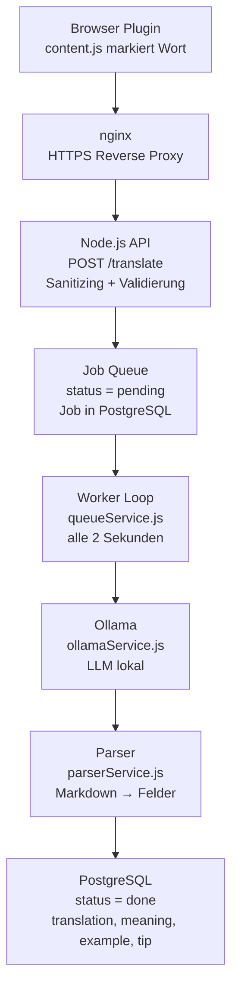
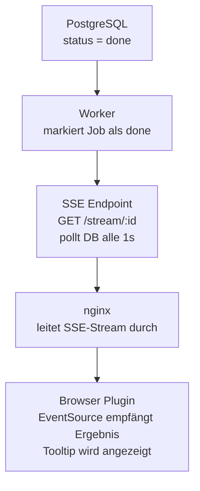

# VocAbi — Architekturdokumentation

> Browser Extension zum kontextbewussten Vokabellernen mit lokalem LLM.

---

## Inhaltsverzeichnis

1. [Systemübersicht](#systemübersicht)
2. [Komponenten](#komponenten)
3. [Datenfluss](#datenfluss)
4. [API Referenz](#api-referenz)
5. [Datenbankschema](#datenbankschema)
6. [Projektstruktur](#projektstruktur)
7. [Setup & Deployment](#setup--deployment)

---

## Systemübersicht

VocAbi ist eine Chrome Extension (Manifest V3) die es Nutzern ermöglicht, Wörter und Phrasen auf beliebigen Webseiten zu markieren und kontextbewusste Übersetzungen + Erklärungen zu erhalten. Die Verarbeitung erfolgt über einen VPS mit lokalem LLM (Ollama) — keine externen API-Kosten, keine Datenweitergabe.

---

## Komponenten

| Komponente | Technologie | Aufgabe |
|---|---|---|
| Browser Plugin | Manifest V3, Vanilla JS | Selektion abfangen, Icon anzeigen, Tooltip rendern |
| Reverse Proxy | nginx | HTTPS-Terminierung, Weiterleitung an Node.js |
| API Server | Node.js, Express | Request-Validierung, Sanitizing, Job erstellen |
| Job Queue | PostgreSQL | FIFO-Verarbeitung, Status-Tracking |
| Worker | Node.js (setInterval) | Pending Jobs abholen und verarbeiten |
| LLM | Ollama (lokal) | Übersetzung + Erklärung generieren |
| Parser | Node.js | Markdown-Output in strukturierte Felder zerlegen |
| Datenbank | PostgreSQL | Vokabeln persistent speichern |
| SSE Endpoint | Node.js, EventSource | Ergebnis asynchron an Browser pushen |

---

## Datenfluss

### Hinweg — Anfrage



### Rückweg — Antwort via SSE



### Ablauf zusammengefasst

```
1. User markiert Wort/Phrase im Browser
2. VocAbi Icon erscheint — User klickt oder nutzt Rechtsklickmenü
3. Plugin sendet POST /translate an api.domain.de
4. Server erstellt Job in DB (status = pending), gibt jobId zurück
5. Plugin öffnet SSE-Verbindung auf GET /stream/:jobId
6. Worker holt Job alle 2s, sendet an Ollama
7. Ollama generiert Antwort, Parser zerlegt sie in Felder
8. Worker speichert Ergebnis in DB (status = done)
9. SSE Endpoint erkennt done, pusht Ergebnis an Browser
10. Plugin schließt SSE-Verbindung, zeigt Tooltip an
```

---

## API Referenz

### `POST /translate`

Erstellt einen neuen Übersetzungs-Job.

**Request:**
```json
{
  "text": "serendipity",
  "type": "vocabulary",
  "context": "It was pure serendipity that brought them together.",
  "targetLang": "english",
  "sourceUrl": "https://example.com/article"
}
```

**Validierungsregeln:**
- `text`: Pflichtfeld, 2–100 Zeichen, max. 5 Wörter, keine reinen Zahlen
- `targetLang`: Whitelist — `english`, `deutsch`, `french`, `spanish`
- `type`: `vocabulary` (1 Wort) oder `phrase` (2–5 Wörter)
- `context`: optional, max. 500 Zeichen
- `sourceUrl`: optional, max. 2000 Zeichen

**Response:**
```json
{
  "jobId": 42
}
```

**Fehler:**
```json
{
  "error": "max 5 words allowed"
}
```

---

### `GET /stream/:id`

Öffnet eine SSE-Verbindung und wartet auf das Ergebnis eines Jobs.

**Response (SSE Event):**
```
data: {"status":"done","result":"..."}
```

Mögliche Status-Werte: `pending`, `processing`, `done`, `failed`

**Fehler:**
```
data: {"status":"failed","error":"Ollama error: 500"}
```

---

## Datenbankschema

### Tabelle: `translations`

```sql
CREATE TABLE translations (
  id            SERIAL PRIMARY KEY,
  input_text    TEXT NOT NULL,
  type          VARCHAR(20),
  context       TEXT,
  target_lang   VARCHAR(50) NOT NULL,
  source_url    TEXT,
  status        VARCHAR(20) DEFAULT 'pending',
  result        TEXT,
  translation   TEXT,
  meaning       TEXT,
  example       TEXT,
  tip           TEXT,
  error         TEXT,
  created_at    TIMESTAMP DEFAULT NOW()
);
```

**Status-Übergänge:**

```
pending → processing → done
                     → failed
```

---

## Projektstruktur

```
vocabi-server/
├── server.js                 # App-Einstiegspunkt, Middleware, Server starten
├── config.js                 # Konfiguration, Konstanten, DB-Credentials
├── routes/
│   └── translate.js          # HTTP Endpoints: POST /translate, GET /stream/:id
├── services/
│   ├── ollamaService.js      # Ollama API aufrufen, Prompt bauen
│   ├── queueService.js       # Worker Loop, Job abholen und verarbeiten
│   └── parserService.js      # Ollama Markdown-Output in Felder zerlegen
├── db/
│   ├── pool.js               # PostgreSQL Verbindung
│   └── translations.js       # SQL Queries (insertJob, getJob, markDone, ...)
└── package.json

vocabi-extension/
├── manifest.json             # Manifest V3, Permissions, Background SW
├── background.js             # Context Menu registrieren, Messages weiterleiten
├── content.js                # Selektion abfangen, Icon/Tooltip, SSE
├── popup.html                # Extension Popup
└── icons/
    ├── icon16.png
    ├── icon32.png
    ├── icon48.png
    └── icon128.png
```

---

## Setup & Deployment

### Voraussetzungen

- Node.js >= 18
- PostgreSQL >= 14
- Ollama (lokal auf VPS)
- nginx
- Certbot (Let's Encrypt)
- pm2

### Lokale Installation

```bash
git clone <repo>
cd vocabi-server
npm install
```

### Umgebungsvariablen

Aktuell in `config.js` — für Production in `.env` auslagern:

```js
export const config = {
  port: 3000,
  model: 'qwen2.5:latest',
  ollamaUrl: 'http://127.0.0.1:11434/api/generate',
  db: {
    host: 'localhost',
    port: 5432,
    database: 'vocabi',
    user: 'postgres',
    password: 'DEIN_PASSWORT'
  }
};
```

### Server starten

```bash
pm2 start server.js --name vocabi-server
pm2 save
pm2 startup
```

### nginx Konfiguration

```nginx
server {
    listen 80;
    server_name api.domain.de;
    return 301 https://$host$request_uri;
}

server {
    listen 443 ssl;
    server_name api.domain.de;

    ssl_certificate /etc/letsencrypt/live/api.domain.de/fullchain.pem;
    ssl_certificate_key /etc/letsencrypt/live/api.domain.de/privkey.pem;

    location /translate {
        proxy_pass http://127.0.0.1:3000;
        proxy_http_version 1.1;
        proxy_set_header Host $host;
        proxy_set_header X-Real-IP $remote_addr;
        proxy_buffering off;
        proxy_cache off;
        proxy_read_timeout 120s;
    }
}
```

### HTTPS einrichten

```bash
sudo certbot --nginx -d api.domain.de
```

### Browser Extension laden

1. `chrome://extensions` öffnen
2. Entwicklermodus aktivieren
3. "Entpackte Erweiterung laden" → `vocabi-extension/` Ordner wählen

---

## Sicherheit

| Schicht | Maßnahme |
|---|---|
| Plugin | Validierung: max. 5 Wörter, min. 2 Zeichen, keine Zahlen |
| nginx | HTTPS erzwungen, Rate Limiting möglich |
| Node.js | Sanitizing, Whitelist für Sprachen und Typen, try/catch |
| PostgreSQL | Prepared Statements ($1, $2) — SQL Injection nicht möglich |
| Ollama Prompt | Prompt Injection Schutz, untrusted content explizit markiert |

---

*Dokumentation Stand: Mai 2026*
