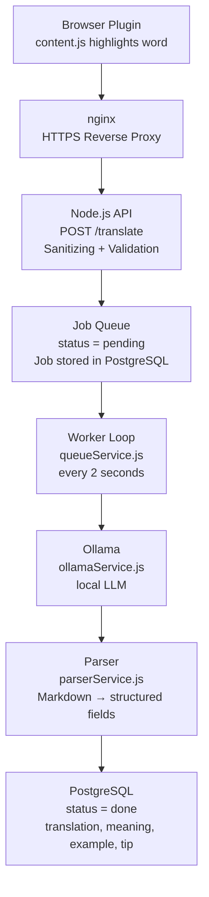
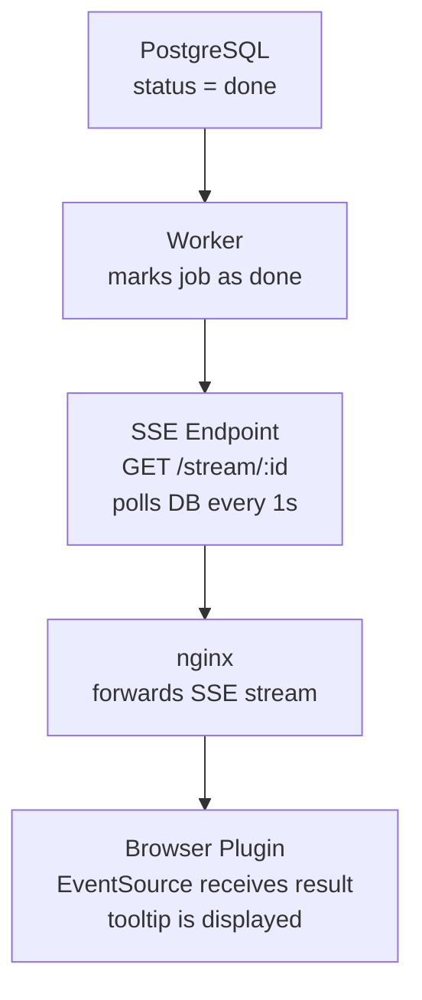

# VocAbi — Architecture Documentation

> Browser extension for context-aware vocabulary learning with a local LLM.

---

## Table of Contents

1. [System Overview](#system-overview)
2. [Components](#components)
3. [Data Flow](#data-flow)
4. [API Reference](#api-reference)
5. [Database Schema](#database-schema)
6. [Project Structure](#project-structure)
7. [Setup & Deployment](#setup--deployment)

---

## System Overview

VocAbi is a Chrome Extension (Manifest V3) that allows users to highlight words and phrases on any webpage and receive context-aware translations and explanations. All processing happens on a VPS with a local LLM (Ollama) — no external API costs, no data sharing.

---

## Components

| Component | Technology | Responsibility |
|---|---|---|
| Browser Plugin | Manifest V3, Vanilla JS | Capture selection, show icon, render tooltip |
| Reverse Proxy | nginx | TLS termination, forward requests to Node.js |
| API Server | Node.js, Express | Request validation, sanitizing, job creation |
| Job Queue | PostgreSQL | FIFO processing, status tracking |
| Worker | Node.js (setInterval) | Fetch pending jobs and process them |
| LLM | Ollama (local) | Generate translation and explanation |
| Parser | Node.js | Break down Markdown output into structured fields |
| Database | PostgreSQL | Persist vocabulary entries |
| SSE Endpoint | Node.js, EventSource | Push result asynchronously to the browser |

---

## Data Flow

### Outbound — Request



### Inbound — Response via SSE



### Flow Summary

```
1.  User highlights a word or phrase in the browser
2.  VocAbi icon appears — user clicks it or uses the right-click menu
3.  Plugin sends POST /translate to api.domain.com
4.  Server creates a job in DB (status = pending), returns jobId
5.  Plugin opens SSE connection on GET /stream/:jobId
6.  Worker picks up job every 2s, sends to Ollama
7.  Ollama generates response, Parser breaks it into structured fields
8.  Worker saves result in DB (status = done)
9.  SSE Endpoint detects done, pushes result to browser
10. Plugin closes SSE connection, displays tooltip
```

---

## API Reference

### `POST /translate`

Creates a new translation job.

**Request:**
```json
{
  "text": "serendipity",
  "type": "vocabulary",
  "context": "It was pure serendipity that brought them together.",
  "targetLang": "english",
  "sourceUrl": "https://example.com/article"
}
```

**Validation rules:**
- `text`: required, 2–100 characters, max. 5 words, no pure numbers
- `targetLang`: whitelist — `english`, `deutsch`, `french`, `spanish`
- `type`: `vocabulary` (1 word) or `phrase` (2–5 words)
- `context`: optional, max. 500 characters
- `sourceUrl`: optional, max. 2000 characters

**Response:**
```json
{
  "jobId": 42
}
```

**Error:**
```json
{
  "error": "max 5 words allowed"
}
```

---

### `GET /stream/:id`

Opens an SSE connection and waits for the job result.

**Response (SSE Event):**
```
data: {"status":"done","result":"..."}
```

Possible status values: `pending`, `processing`, `done`, `failed`

**Error:**
```
data: {"status":"failed","error":"Ollama error: 500"}
```

---

## Database Schema

### Table: `translations`

```sql
CREATE TABLE translations (
  id            SERIAL PRIMARY KEY,
  input_text    TEXT NOT NULL,
  type          VARCHAR(20),
  context       TEXT,
  target_lang   VARCHAR(50) NOT NULL,
  source_url    TEXT,
  status        VARCHAR(20) DEFAULT 'pending',
  result        TEXT,
  translation   TEXT,
  meaning       TEXT,
  example       TEXT,
  tip           TEXT,
  error         TEXT,
  created_at    TIMESTAMP DEFAULT NOW()
);
```

**Status transitions:**

```
pending → processing → done
                     → failed
```

---

## Project Structure

```
vocabi-server/
├── server.js                 # App entry point, middleware, server start
├── config.js                 # Configuration, constants, DB credentials
├── routes/
│   └── translate.js          # HTTP endpoints: POST /translate, GET /stream/:id
├── services/
│   ├── ollamaService.js      # Call Ollama API, build prompt
│   ├── queueService.js       # Worker loop, fetch and process jobs
│   └── parserService.js      # Parse Ollama Markdown output into fields
├── db/
│   ├── pool.js               # PostgreSQL connection pool
│   └── translations.js       # SQL queries (insertJob, getJob, markDone, ...)
└── package.json

vocabi-extension/
├── manifest.json             # Manifest V3, permissions, background SW
├── background.js             # Register context menu, forward messages
├── content.js                # Capture selection, icon/tooltip, SSE
├── popup.html                # Extension popup
└── icons/
    ├── icon16.png
    ├── icon32.png
    ├── icon48.png
    └── icon128.png
```

---

## Setup & Deployment

### Prerequisites

- Node.js >= 18
- PostgreSQL >= 14
- Ollama (local on VPS)
- nginx
- Certbot (Let's Encrypt)
- pm2

### Local Installation

```bash
git clone <repo>
cd vocabi-server
npm install
```

### Configuration

Currently stored in `config.js` — move to `.env` for production:

```js
export const config = {
  port: 3000,
  model: 'qwen2.5:latest',
  ollamaUrl: 'http://127.0.0.1:11434/api/generate',
  db: {
    host: 'localhost',
    port: 5432,
    database: 'vocabi',
    user: 'postgres',
    password: 'YOUR_PASSWORD'
  }
};
```

### Start Server

```bash
pm2 start server.js --name vocabi-server
pm2 save
pm2 startup
```

### nginx Configuration

```nginx
server {
    listen 80;
    server_name api.domain.com;
    return 301 https://$host$request_uri;
}

server {
    listen 443 ssl;
    server_name api.domain.com;

    ssl_certificate /etc/letsencrypt/live/api.domain.com/fullchain.pem;
    ssl_certificate_key /etc/letsencrypt/live/api.domain.com/privkey.pem;

    location /translate {
        proxy_pass http://127.0.0.1:3000;
        proxy_http_version 1.1;
        proxy_set_header Host $host;
        proxy_set_header X-Real-IP $remote_addr;
        proxy_buffering off;
        proxy_cache off;
        proxy_read_timeout 120s;
    }
}
```

### Enable HTTPS

```bash
sudo certbot --nginx -d api.domain.com
```

### Load Browser Extension

1. Open `chrome://extensions`
2. Enable Developer Mode
3. Click "Load unpacked" → select `vocabi-extension/` folder

---

## Security

| Layer | Measure |
|---|---|
| Plugin | Validation: max. 5 words, min. 2 characters, no pure numbers |
| nginx | HTTPS enforced, rate limiting configurable |
| Node.js | Sanitizing, language and type whitelist, try/catch on all routes |
| PostgreSQL | Prepared statements ($1, $2) — SQL injection not possible |
| Ollama Prompt | Prompt injection protection, untrusted content explicitly marked |

---

*Documentation as of May 2026*
