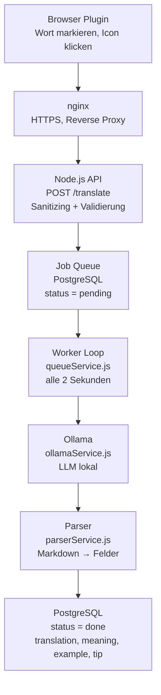
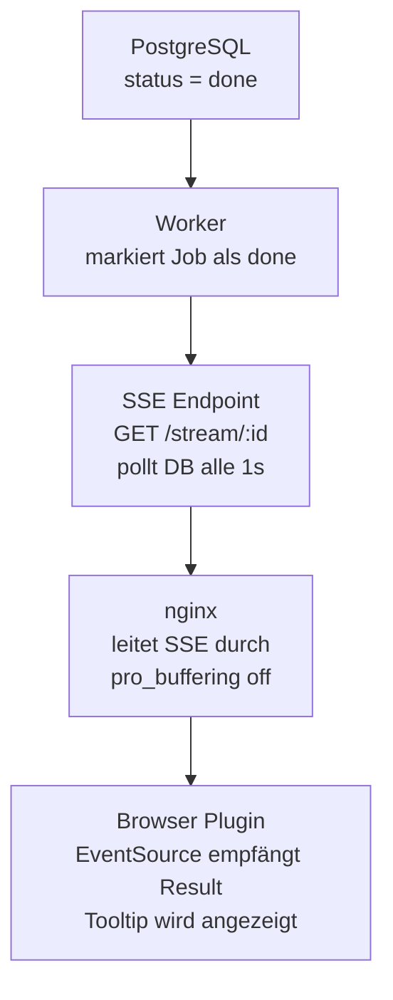

# VocAbi — Entwicklerdokumentation

**Stand:** Juli 2026  
**Version:** MVP Pre-Auth  
**Zielgruppe:** Entwickler und Product Owner

---

## Inhaltsverzeichnis

1. [Produktvision & Ziel](#1-produktvision--ziel)
2. [Technologie-Stack](#2-technologie-stack)
3. [Systemarchitektur](#3-systemarchitektur)
4. [Datenbankschema](#4-datenbankschema)
5. [API-Referenz](#5-api-referenz)
6. [Browser Extension](#6-browser-extension)
7. [Node.js Backend](#7-nodejs-backend)
8. [Dashboard](#8-dashboard)
9. [Infrastruktur & Deployment](#9-infrastruktur--deployment)
10. [Sicherheit](#10-sicherheit)
11. [Bekannte Bugs & Lösungen](#11-bekannte-bugs--lösungen)
12. [MVP-Roadmap — Was noch fehlt](#12-mvp-roadmap--was-noch-fehlt)

---

## 1. Produktvision & Ziel

VocAbi ist eine Chrome Extension für **kontextbewusstes Vokabellernen**. Der Nutzer markiert ein Wort oder eine Phrase auf einer beliebigen Webseite — VocAbi übersetzt es mit einem lokalen LLM und erklärt es im Kontext des umgebenden Satzes. Gelernte Vokabeln werden mit dem **SM-2 Spaced-Repetition-Algorithmus** wiederholt.

**Kernprinzipien:**
- Lernen im natürlichen Kontext statt isolierter Vokabellisten
- Lokale KI — keine externen API-Kosten, keine Datenweitergabe
- Minimale Friction — markieren, klicken, fertig
- Wissenschaftlich fundiert — SM-2 für optimale Wiederholungsintervalle

---

## 2. Technologie-Stack

| Bereich | Technologie | Begründung |
|---|---|---|
| Browser Extension | Manifest V3, Vanilla JS | Chrome-Standard, kein Framework-Overhead |
| Backend | Node.js, Express 5 | Async-first, einfache SSE-Integration |
| Datenbank | PostgreSQL 14 | Relational, ACID-konform, gut für Queue-Pattern |
| LLM Runtime | Ollama (lokal auf VPS) | Keine API-Kosten, Datenschutz, volle Kontrolle |
| LLM Modell | qwen2.5:latest (7.6B) | Bestes Preis-Leistungs-Verhältnis für Übersetzungen |
| Reverse Proxy | nginx | TLS-Terminierung, SSE-Buffering-Kontrolle |
| Prozessmanager | pm2 | Autostart, Logging, Zero-Downtime-Restart |
| HTTPS | Let's Encrypt / Certbot | Kostenlos, automatisch erneuerbar |
| Deployment | rsync | Einfache lokale → VPS Synchronisation |

**Verfügbare Ollama-Modelle auf dem VPS:**

| Modell | Größe | Status |
|---|---|---|
| qwen2.5:latest | 7.6B | ✅ Aktiv |
| qwen2.5:14b | 14.8B | Verfügbar |
| granite4.1:3b | 3.4B | Verfügbar |
| qwen3.5:latest | 9.7B | Verfügbar |
| llama3.2:1b | 1.2B | Verfügbar |

---

## 3. Systemarchitektur

### Hinweg — Anfrage



### Rückweg — Antwort via SSE



### Ablauf in 10 Schritten

```
1.  User markiert Wort/Phrase im Browser (max. 7 Wörter)
2.  Validierung: Länge, Typ (vocabulary/phrase), keine Zahlen
3.  VocAbi Icon erscheint rechts neben der Selektion
4.  User klickt Icon oder nutzt Rechtsklick-Menü
5.  Plugin sendet POST /translate an api.prodowner.de
6.  Server erstellt Job in DB (status = pending), gibt jobId zurück
7.  Plugin öffnet SSE-Verbindung auf GET /stream/:jobId
8.  Worker holt Job alle 2s, sendet an Ollama
9.  Ollama generiert Antwort → Parser zerlegt Markdown in Felder
10. Worker speichert Ergebnis (status = done) → SSE pusht an Browser → Tooltip
```

### Warum diese Architektur?

**Warum Job Queue statt synchroner Verarbeitung?**
Ollama benötigt je nach Modell 5–90 Sekunden. Ein synchroner Request würde bei mehreren gleichzeitigen Nutzern zu HTTP-Timeouts führen und den Server blockieren. Die Queue entkoppelt Anfrage und Verarbeitung vollständig und macht das System robust gegen temporäre Ollama-Ausfälle.

**Warum SSE statt Polling?**
Server-Sent Events halten eine einzige persistente HTTP-Verbindung offen. Der Server pusht das Ergebnis aktiv sobald es fertig ist — kein unnötiger Traffic, keine Latenz durch Poll-Intervalle.

**Warum `FOR UPDATE SKIP LOCKED` in PostgreSQL?**
Wenn später mehrere Worker parallel laufen, könnte ohne Locking derselbe Job von zwei Workern gleichzeitig verarbeitet werden. `FOR UPDATE SKIP LOCKED` sperrt den ausgewählten Job atomar und überspringt bereits gesperrte Einträge — eine elegante, datenbankgestützte Lösung ohne externe Queue-Software wie Redis.

**Warum Ollama lokal?**
Keine variablen Kosten pro API-Call, keine Datenweitergabe der Nutzervokabeln, volle Kontrolle über Modellauswahl und Prompting.

---

## 4. Datenbankschema

### Tabelle: `translations`

```sql
CREATE TABLE translations (
  id              SERIAL PRIMARY KEY,
  
  -- Eingabe
  input_text      TEXT NOT NULL,           -- markierter Text
  type            VARCHAR(20),             -- 'vocabulary' | 'phrase'
  context         TEXT,                    -- umgebender Satz aus DOM
  target_lang     VARCHAR(50) NOT NULL,    -- Zielsprache
  source_url      TEXT,                    -- URL der Quellseite
  
  -- Queue-Status
  status          VARCHAR(20) DEFAULT 'pending',
  error           TEXT,                    -- Fehlermeldung bei 'failed'
  
  -- LLM Output (roh + geparst)
  result          TEXT,                    -- roher Ollama Markdown-Output
  translation     TEXT,                    -- geparste Übersetzung
  meaning         TEXT,                    -- geparste Bedeutung
  example         TEXT,                    -- geparster Beispielsatz
  tip             TEXT,                    -- geparster Lerntipp
  
  -- Spaced Repetition (SM-2)
  mastered        BOOLEAN DEFAULT FALSE,
  interval_days   INTEGER DEFAULT 1,       -- aktuelles Wiederholungsintervall
  ease_factor     FLOAT DEFAULT 2.5,       -- Schwierigkeitsfaktor (SM-2)
  review_count    INTEGER DEFAULT 0,       -- Anzahl bisheriger Reviews
  next_review     TIMESTAMP DEFAULT NOW(), -- nächster Fälligkeitszeitpunkt
  
  created_at      TIMESTAMP DEFAULT NOW()
);
```

**Status-Übergänge:**

```
pending → processing → done
                     → failed
```

**Wichtig:** Es gibt aktuell keinen `CHECK` Constraint auf `status` — theoretisch könnten andere Werte gespeichert werden. Das sollte vor dem Multi-User-Launch gesichert werden:

```sql
ALTER TABLE translations 
  ADD CONSTRAINT valid_status 
  CHECK (status IN ('pending', 'processing', 'done', 'failed'));
```

---

## 5. API-Referenz

### POST /translate

Erstellt einen neuen Übersetzungs-Job.

**Request Body:**
```json
{
  "text": "serendipity",
  "type": "vocabulary",
  "context": "It was pure serendipity that brought them together.",
  "targetLang": "english",
  "sourceUrl": "https://example.com/article"
}
```

**Validierungsregeln (serverseitig):**
- `text`: Pflichtfeld, 2–100 Zeichen, max. 5 Wörter, keine reinen Zahlen
- `targetLang`: Whitelist — `english`, `deutsch`, `french`, `spanish`
- `type`: Whitelist — `vocabulary`, `phrase` (Fallback: `vocabulary`)
- `context`: optional, max. 500 Zeichen
- `sourceUrl`: optional, max. 2000 Zeichen

**Response (200):**
```json
{ "jobId": 129 }
```

**Response (400):**
```json
{ "error": "max 5 words allowed" }
```

---

### GET /stream/:id

SSE-Verbindung für Job-Ergebnis. Pollt intern die DB alle 1 Sekunde.

**Response Events:**
```
data: {"status":"done","result":"**Translation:** ..."}

data: {"status":"failed","error":"Ollama error: 500"}

data: {"error":"Job not found"}
```

**Verbindung:** Bleibt offen bis `status = done | failed` oder Client trennt.

---

### GET /vocabulary

Alle abgeschlossenen Vokabeln (`status = done`), sortiert nach `created_at DESC`.

**Response (200):**
```json
[
  {
    "id": 82,
    "input_text": "Meritocracy",
    "translation": "Meritocracy",
    "meaning": "...",
    "example": "...",
    "tip": "...",
    "type": "vocabulary",
    "target_lang": "english",
    "mastered": false,
    "interval_days": 3,
    "ease_factor": 2.6,
    "review_count": 4,
    "next_review": "2026-07-01T02:34:15.726Z",
    "created_at": "2026-05-26T10:00:00Z"
  }
]
```

**Achtung:** Stelle sicher dass alle SM-2-Felder (`interval_days`, `ease_factor`, `review_count`, `next_review`, `mastered`) in der `SELECT`-Klausel stehen — ein früherer Bug zeigte, dass fehlende Spalten im SELECT zu `undefined`-Werten im Frontend führten, die der Dashboard-State fälschlicherweise mit Default-Werten überschrieb.

---

### GET /vocabulary/stats

Aggregierte Statistiken über alle `done`-Einträge.

**Response (200):**
```json
{
  "total": "115",
  "vocabulary_count": "14",
  "phrase_count": "48"
}
```

---

### GET /vocabulary/sm2-stats

Spaced-Repetition-Statistiken für das Settings-Panel.

**Response (200):**
```json
{
  "avg_ease_factor": "2.45",
  "avg_interval_days": "1.8",
  "avg_review_count": "2.3",
  "mastered_count": "5",
  "never_reviewed_count": "62",
  "in_progress_count": "53"
}
```

---

### PATCH /vocabulary/:id/review

SM-2 Bewertung für eine Flashcard persistieren.

**Request Body:**
```json
{ "rating": "good" }
```

Mögliche Werte: `hard`, `good`, `easy`

**SM-2 Algorithmus:**

```
hard:  interval = 1
       ease_factor = MAX(1.3, ease_factor - 0.2)

good:  interval = review_count === 0 ? 1
                : review_count === 1 ? 3
                : ROUND(interval × ease_factor)

easy:  interval = review_count === 0 ? 1
                : review_count === 1 ? 3
                : ROUND(interval × ease_factor × 1.3)
       ease_factor = MIN(4.0, ease_factor + 0.1)

mastered = ease_factor >= 3.0 AND interval_days >= 21
```

**Response (200):**
```json
{
  "interval_days": 3,
  "ease_factor": 2.6,
  "review_count": 2,
  "mastered": false,
  "next_review": "2026-07-03T02:07:47.256Z"
}
```

---

### DELETE /vocabulary/:id

Löscht einen Eintrag dauerhaft aus der Datenbank.

**Response (200):**
```json
{ "deleted": true, "id": 82 }
```

**Response (404):**
```json
{ "error": "Not found" }
```

---

## 6. Browser Extension

### Dateien

```
vocabi-extension/
├── manifest.json          # Manifest V3, Permissions, Service Worker
├── background.js          # Context Menu, Dashboard-Öffnung
├── content.js             # Selektion, Icon, Tooltip, SSE, Storage
├── icons/
│   ├── icon16.png
│   ├── icon32.png
│   ├── icon48.png
│   └── icon128.png
└── dashboard/
    ├── dashboard.html     # Extension Dashboard Page
    ├── dashboard.css      # Styles mit CSS Custom Properties
    └── dashboard.js      # State, Render-Funktionen, API-Calls
```

### manifest.json

```json
{
  "manifest_version": 3,
  "name": "VocAbi",
  "version": "1.0",
  "permissions": ["activeTab", "scripting", "storage", "contextMenus"],
  "content_scripts": [{ "matches": ["<all_urls>"], "js": ["content.js"] }],
  "background": { "service_worker": "background.js" },
  "action": { "default_icon": { "128": "icons/icon128.png" } },
  "web_accessible_resources": [{
    "resources": ["dashboard/dashboard.html", "dashboard/dashboard.css", "dashboard/dashboard.js"],
    "matches": ["<all_urls>"]
  }]
}
```

**Wichtige CSP-Regel in Manifest V3:** Kein Inline-JavaScript erlaubt. Das bedeutet:
- Kein `onclick="..."` in HTML-Attributen
- Kein `<script>` Block direkt im HTML
- Keine `javascript:` URLs
- Lösung: **Event Delegation** statt Inline-Handler

```javascript
// FALSCH — wird von CSP blockiert
`<button onclick="deleteCard(${card.id})">Löschen</button>`

// RICHTIG — Event Delegation
`<button data-delete-id="${card.id}">Löschen</button>`

el("#vocabTable").addEventListener("click", async (e) => {
  const btn = e.target.closest("[data-delete-id]");
  if (!btn) return;
  await deleteCard(btn.dataset.deleteId);
});
```

### content.js — Kernfunktionen

**Text-Selektion → Validierung → Icon:**

```javascript
document.addEventListener('mouseup', (e) => {
  const selectedText = window.getSelection().toString().trim();
  const analysis = analyzeSelection(selectedText);
  if (!analysis.valid) { showError(analysis.reason, rect); return; }
  savedSelection = { text, type: analysis.type, context, rect };
  showIcon(rect);
});
```

**Validierungsregeln (clientseitig):**
- Min. 2 Zeichen
- Max. 7 Wörter
- Keine reinen Zahlen
- 1 Wort → `type: 'vocabulary'`, 2+ Wörter → `type: 'phrase'`

**Kontext-Extraktion aus DOM:**
```javascript
function extractContext(range) {
  const text = range.startContainer.textContent || '';
  const sentences = text.match(/[^.!?]+[.!?]*/g) || [text];
  const selected = range.toString();
  return (sentences.find(s => s.includes(selected)) || '').trim();
}
```

**Zielsprache aus `chrome.storage.local`:**
```javascript
async function sendToAPI(selection) {
  const stored = await chrome.storage.local.get('targetLang');
  const targetLang = stored.targetLang || 'english';
  // ...
}
```

**SSE-Verbindung nach Job-Erstellung:**
```javascript
function waitForResult(jobId, rect) {
  const eventSource = new EventSource(`${API_URL}/stream/${jobId}`);
  eventSource.onmessage = (e) => {
    const data = JSON.parse(e.data);
    eventSource.close();
    tooltip.textContent = data.status === 'done' ? data.result : 'Error.';
    if (data.status === 'done') {
      chrome.runtime.sendMessage({ action: 'vocabAdded' });
    }
  };
}
```

### background.js

```javascript
// Context Menu registrieren
chrome.runtime.onInstalled.addListener(() => {
  chrome.contextMenus.create({
    id: 'vocabi-translate',
    title: 'Add to VocAbi',
    contexts: ['selection']
  });
});

// Context Menu Klick → an content.js weiterleiten
chrome.contextMenus.onClicked.addListener((info, tab) => {
  if (info.menuItemId !== 'vocabi-translate') return;
  chrome.tabs.sendMessage(tab.id, { action: 'translate' });
});

// Extension Icon Klick → Dashboard öffnen
chrome.action.onClicked.addListener(() => {
  chrome.tabs.create({ url: 'dashboard/dashboard.html' });
});
```

---

## 7. Node.js Backend

### Projektstruktur

```
node/
├── server.js              # Express App, Middleware, Routen-Registrierung
├── config.js              # Konfiguration, DB-Credentials, Modell
├── routes/
│   ├── translate.js       # POST /translate, GET /stream/:id
│   └── vocabulary.js      # GET /, /stats, /sm2-stats, PATCH /:id/review, DELETE /:id
├── services/
│   ├── ollamaService.js   # Prompt-Bau, Ollama HTTP-Call
│   ├── queueService.js    # Worker Loop, Startup-Recovery, Timeout-Handler
│   └── parserService.js   # Regex-Parser: Markdown → strukturierte Felder
├── db/
│   ├── pool.js            # PostgreSQL Connection Pool
│   └── translations.js    # SQL-Queries als dedizierte Funktionen
└── package.json
```

### config.js

```javascript
export const config = {
  port: 3000,
  model: 'qwen2.5:latest',
  ollamaUrl: 'http://127.0.0.1:11434/api/generate',
  db: {
    host: 'localhost',
    port: 5432,
    database: 'vocabi',
    user: 'postgres',
    password: 'DEIN_PASSWORT'  // für Production in .env auslagern
  }
};
```

### Prompt-Struktur (ollamaService.js)

```
System: Expert language teacher, immersive learning
Input:  - Typ-Instruktion (vocabulary vs. phrase)
        - Untrusted Content Marker (Prompt Injection Schutz)
        - Selected text (in """ eingeschlossen)
        - Sentence context
        - Target language
Output: Erzwungenes Format:
        **Translation:** [...]
        **Meaning:** [...]
        **Example:** [...]
        **Tip:** [...]
```

Der Prompt unterscheidet zwischen `vocabulary` und `phrase`:
- `vocabulary`: Fokus auf Bedeutung, Verwendung, Wortformen
- `phrase`: Prüft auf idiomatische Bedeutung jenseits des Wortsinns

### Parser (parserService.js)

Zerlegt den konsistenten Markdown-Output per Regex:

```javascript
function extract(label, raw) {
  const regex = new RegExp(`\\*\\*${label}:\\*\\*\\s*([\\s\\S]*?)(?=\\*\\*|$)`);
  const match = raw.match(regex);
  return match ? match[1].trim() : null;
}
```

**Wichtig:** Die Struktur des Ollama-Outputs ist nach 100+ Tests konsistent — der Regex-Ansatz ist daher zuverlässig und deutlich einfacher als JSON-Output vom Modell zu erzwingen.

### Worker Loop & Job Recovery (queueService.js)

**Drei Schutzmechanismen gegen Zombie-Jobs:**

```javascript
export async function startWorker() {
  // 1. Beim Start: hängende 'processing' Jobs zurücksetzen
  const recovered = await recoverStuckJobs();
  if (recovered > 0) {
    console.log(`${recovered} Jobs beim Start zurückgesetzt`);
  }

  // 2. Alle 2 Sekunden: nächsten pending Job verarbeiten
  setInterval(processNextJob, 2000);

  // 3. Alle 2 Minuten: Jobs die >5 Minuten in 'processing' hängen → 'failed'
  setInterval(async () => {
    const failed = await failStuckProcessingJobs(5);
    if (failed > 0) console.log(`${failed} Jobs wegen Timeout auf failed gesetzt`);
  }, 120000);

  console.log('Worker started');
}
```

**Warum `FOR UPDATE SKIP LOCKED`:**
```sql
UPDATE translations SET status = 'processing'
WHERE id = (
  SELECT id FROM translations
  WHERE status = 'pending'
  ORDER BY created_at ASC
  LIMIT 1
  FOR UPDATE SKIP LOCKED  -- verhindert Race Conditions bei parallelen Workern
)
RETURNING *
```

---

## 8. Dashboard

### Panels

| Panel | Funktion |
|---|---|
| Dashboard | KPIs, Zuletzt hinzugefügt, Nächste Reviews |
| Vokabeln | Vollständige Tabelle, Fortschrittslogik, Löschen-Funktion |
| Flash Cards | SM-2 Lernmodus, Flip-Animation, Bewertungsbuttons |
| Settings | Dark Mode, Nur fällige Karten, Auto-Flip, Zielsprache, SM-2 Statistik |

### State-Management

```javascript
const state = {
  theme: "light",
  dueOnly: true,        // nur fällige Karten in Flashcard-Queue
  autoFlip: false,      // automatische Kartenwendung nach 3s
  currentPanel: "dashboard",
  currentCardIndex: 0,
  cards: [],            // alle Vokabeln aus DB
};
```

### SM-2 im Frontend

Nach einer Bewertung wird `PATCH /vocabulary/:id/review` aufgerufen und der Card-State lokal aktualisiert:

```javascript
async function applyReview(kind) {
  const card = nextQueue()[state.currentCardIndex];
  const updated = await fetch(`${API_BASE}/vocabulary/${card.id}/review`, {
    method: 'PATCH',
    body: JSON.stringify({ rating: kind })
  }).then(r => r.json());

  // Lokalen State aktualisieren
  card.interval = updated.interval_days;
  card.ease_factor = updated.ease_factor;
  card.reviews = updated.review_count;
  card.mastered = updated.mastered;
  card.dueAt = updated.next_review;

  // Zur nächsten Karte springen
  const newQueue = nextQueue();
  state.currentCardIndex = newQueue.length > 0
    ? state.currentCardIndex % newQueue.length
    : 0;

  rerender();
}
```

### Live-Update bei neuer Übersetzung

```javascript
// content.js sendet nach erfolgreichem Job:
chrome.runtime.sendMessage({ action: 'vocabAdded' });

// dashboard.js hört darauf:
chrome.runtime.onMessage.addListener((message) => {
  if (message.action === 'vocabAdded') loadVocabulary();
});
```

---

## 9. Infrastruktur & Deployment

### VPS-Spezifikationen

```
IP:            195.179.193.132
Domain:        api.prodowner.de
OS:            Ubuntu 24.04 LTS
User:          marius
SSH-Key:       ~/.ssh/id_ed25519_new
```

### nginx-Konfiguration

```nginx
server {
    listen 80;
    server_name api.prodowner.de;
    return 301 https://$host$request_uri;
}

server {
    listen 443 ssl;
    server_name api.prodowner.de;

    ssl_certificate /etc/letsencrypt/live/api.prodowner.de/fullchain.pem;
    ssl_certificate_key /etc/letsencrypt/live/api.prodowner.de/privkey.pem;

    location /.well-known/acme-challenge/ {
        root /var/www/html;
        allow all;
    }

    location = / { return 301 https://$host$request_uri; }

    location /translate {
        proxy_pass http://127.0.0.1:3000;
        proxy_http_version 1.1;
        proxy_set_header Host $host;
        proxy_set_header X-Real-IP $remote_addr;
        proxy_buffering off;    # kritisch für SSE
        proxy_cache off;
        proxy_read_timeout 220s;
    }

    location /vocabulary {
        proxy_pass http://127.0.0.1:3000;
        proxy_http_version 1.1;
        proxy_set_header Host $host;
        proxy_set_header X-Real-IP $remote_addr;
        proxy_read_timeout 30s;
    }
}
```

**Warum `proxy_buffering off` für SSE?**
nginx puffert standardmäßig Responses und sendet sie gebündelt — das würde SSE-Events verzögern oder gar nicht ankommen lassen. `proxy_buffering off` sorgt dafür, dass jedes `data: {...}\n\n` sofort an den Client weitergeleitet wird.

### Deployment-Prozess

```bash
# 1. Lokal → VPS synchronisieren
rsync -avz "/Users/mariuskalder/Library/Mobile Documents/com~apple~CloudDocs/00 FULL STACK DEVELOPER/PROJECTS/vocabi/" \
  marius@195.179.193.132:/home/marius/vocabi-server/

# 2. Auf dem VPS
cd ~/vocabi-server/node
npm install          # falls neue Dependencies
pm2 restart vocabi-server

# 3. nginx neu laden (bei Konfig-Änderungen)
sudo nginx -t && sudo systemctl reload nginx
```

### pm2-Befehle

```bash
pm2 status                          # alle Prozesse
pm2 logs vocabi-server --lines 30   # Logs anzeigen
pm2 restart vocabi-server           # Neustart
pm2 restart vocabi-server --update-env  # mit Umgebungsvariablen aktualisieren
pm2 save                            # Prozessliste sichern
pm2 startup                         # Autostart einrichten
```

---

## 10. Sicherheit

| Schicht | Maßnahme | Status |
|---|---|---|
| Plugin | Validierung: max. 7 Wörter, min. 2 Zeichen, keine Zahlen | ✅ |
| Plugin | CSP-konform: keine Inline-Scripts, Event Delegation | ✅ |
| nginx | HTTPS erzwungen, HTTP → HTTPS Redirect | ✅ |
| nginx | `proxy_buffering off` nur für SSE-Endpoint | ✅ |
| Node.js | Sanitizing, Typ-Prüfung, Whitelist für Sprachen und Typen | ✅ |
| Node.js | try/catch auf allen Route-Handlern | ✅ |
| PostgreSQL | Prepared Statements (`$1`, `$2`) — SQL Injection nicht möglich | ✅ |
| Ollama Prompt | Untrusted Content explizit markiert, Prompt Injection Schutz | ✅ |
| CORS | Aktuell `*` — muss nach Auth-Implementierung eingeschränkt werden | ⚠️ |
| Rate Limiting | Noch nicht implementiert | ❌ |
| Authentifizierung | Noch nicht implementiert | ❌ |
| DB Constraint | `CHECK` auf `status` Spalte fehlt | ❌ |

---

## 11. Bekannte Bugs & Lösungen

### Bug 1 — SM-2 Felder nicht persistent im Dashboard

**Symptom:** Nach erneutem Öffnen des Dashboards zeigt die Vokabelliste alle Karten als "Neu" an, obwohl in der DB korrekte `interval_days`, `ease_factor`, `next_review` Werte stehen.

**Ursache:** Der `GET /vocabulary` Endpoint selektierte die SM-2-Spalten nicht im `SELECT` Statement. Das Mapping im Frontend fiel daher auf Fallback-Werte zurück (`interval: row.interval_days || 1` → `1`, da `row.interval_days === undefined`).

**Lösung:** Alle SM-2-Spalten explizit in die SQL-Query aufnehmen:
```sql
SELECT id, input_text, translation, meaning, example, tip, type,
       mastered, interval_days, ease_factor, review_count, next_review, created_at
FROM translations WHERE status = 'done'
```

---

### Bug 2 — Zombie-Jobs bei pm2-Neustart

**Symptom:** Nach `pm2 restart` bleiben Jobs die gerade von Ollama verarbeitet wurden für immer auf `status = 'processing'` hängen und werden nie fertig.

**Ursache:** Der Worker Loop holt nur Jobs mit `status = 'pending'` ab. Ein Job der während des Neustarts im `processing`-Zustand war, wird von niemandem zurückgesetzt.

**Lösung:** Zwei Mechanismen in `queueService.js`:
1. `recoverStuckJobs()` beim Server-Start — setzt alle `processing` Jobs auf `pending`
2. `failStuckProcessingJobs(5)` alle 2 Minuten — setzt Jobs die >5 Minuten in `processing` hängen auf `failed`

---

### Bug 3 — CSP blockiert `onclick` Inline-Handler

**Symptom:** Buttons mit `onclick="..."` im Dashboard funktionieren nicht — Chrome blockiert Inline-Event-Handler in Extension-Seiten.

**Ursache:** Manifest V3 Extension-Seiten haben eine strikte Content Security Policy die Inline-Scripts untersagt.

**Lösung:** Event Delegation statt Inline-Handler — `data-*` Attribute statt `onclick`.

---

### Bug 4 — renderQueue() auf nicht-existentem DOM-Element

**Symptom:** `TypeError: Cannot set properties of null (setting 'innerHTML')` nach Umbau des Flashcard-Panels — `renderQueue()` versuchte `#reviewQueue` zu befüllen, das wir entfernt hatten.

**Lösung:** `renderQueue()` Funktion und deren Aufruf in `rerender()` entfernen.

---

## 12. MVP-Roadmap — Was noch fehlt

### 🔴 Kritisch — ohne diese Features kein Multi-User MVP

#### Authentifizierung

**Warum:** Ohne Auth gehören alle Vokabeln niemandem — jeder Nutzer sieht alle Daten aller anderen Nutzer.

**Geplanter Stack:**
```bash
npm install bcrypt jsonwebtoken passport passport-google-oauth20 passport-github2
```

**Neue DB-Tabelle:**
```sql
CREATE TABLE users (
  id            SERIAL PRIMARY KEY,
  email         TEXT UNIQUE,
  password_hash TEXT,          -- NULL für SSO-User
  google_id     TEXT UNIQUE,   -- NULL für Email-User
  github_id     TEXT UNIQUE,   -- NULL für Email-User
  created_at    TIMESTAMP DEFAULT NOW()
);
```

**`translations` Erweiterung:**
```sql
ALTER TABLE translations ADD COLUMN user_id INTEGER REFERENCES users(id);
```

**Neue Endpoints:**
```
POST /auth/register           → Email + Passwort, bcrypt Hash
POST /auth/login              → JWT ausstellen
GET  /auth/google             → OAuth2 Flow Google
GET  /auth/google/callback    → JWT ausstellen
GET  /auth/github             → OAuth2 Flow GitHub
GET  /auth/github/callback    → JWT ausstellen
```

**Middleware:**
```javascript
// JWT auf allen geschützten Endpoints prüfen
app.use('/vocabulary', authMiddleware, vocabularyRouter);
app.use('/translate', authMiddleware, translateRouter);
```

**Plugin-Anpassung:**
- Login-Seite in der Extension
- Token in `chrome.storage.local` speichern
- `Authorization: Bearer <token>` bei jedem Request

**Alle DB-Queries erweitern:**
```sql
WHERE status = 'done' AND user_id = $1
```

---

#### Rate Limiting

```nginx
limit_req_zone $binary_remote_addr zone=vocabi:10m rate=10r/m;

location /translate {
    limit_req zone=vocabi burst=5 nodelay;
    ...
}
```

---

### 🟡 Wichtig

- **Detailansicht Vokabeln** — Klick auf Tabellenzeile öffnet `meaning`, `example`, `tip`, `context`, `source_url`
- **CORS einschränken** — von `*` auf Extension-ID nach Auth-Implementierung
- **Error Handling im Plugin** — Unterscheidung Netzwerkfehler vs. Server-Error vs. Timeout
- **Dashboard Login-Flow** — nach Auth: Token prüfen, bei 401 zu Login weiterleiten
- **DB Constraint** — `CHECK (status IN ('pending', 'processing', 'done', 'failed'))`

---

### 🟢 Nice-to-have

- Vokabeln exportieren (CSV, Anki-Format)
- Keyboard Shortcuts (Escape zum Schließen, konfigurierbare Trigger-Taste)
- Offline-Indikator wenn VPS nicht erreichbar
- Account Linking (Google + GitHub nachträglich verknüpfen)
- Uptime-Monitoring (z.B. UptimeRobot)
- `.env` Datei statt Credentials in `config.js`

---

## Zusammenfassung

```
✅ Fertig:
   Browser Plugin (Manifest V3)
   Job Queue + Worker Loop + SSE
   Ollama Pipeline + Prompt + Parser
   SM-2 Algorithmus (Backend + Frontend)
   PostgreSQL mit vollständigem Schema
   Dashboard mit 4 Panels
   Zombie-Job Recovery (Startup + Timeout)
   nginx + HTTPS + pm2

🔴 Kritisch fehlt:
   Authentifizierung (Email + Google SSO + GitHub SSO)
   Rate Limiting

🟡 Wichtig fehlt:
   Detailansicht Vokabeln
   CORS einschränken
   Dashboard Login-Flow

🟢 Nice-to-have:
   Export, Keyboard Shortcuts, Offline-Indikator, .env
```

**Geschätzte Zeit bis MVP (mit Auth + Rate Limiting):** 4–6 Entwicklungstage

---

*Dokumentation erstellt: Juli 2026*  
*Projekt: VocAbi — Kontextbewusstes Vokabellernen mit lokalem LLM*
